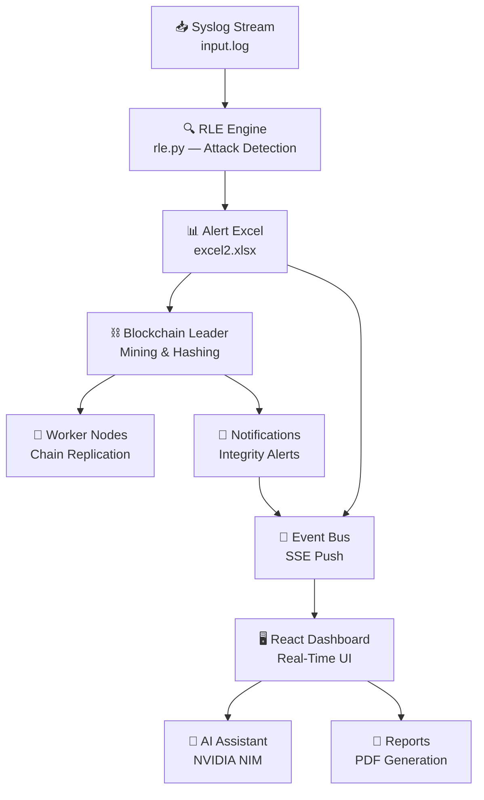

# 🚀 CyberDefenseX — AI + Blockchain Powered Autonomous SIEM & SOAR Platform

**Autonomous. Transparent. Unbreakable.**

> A fully autonomous Cyber Defense System combining **real-time AI threat detection**, **blockchain-backed tamper-proof audit logs**, and **self-healing infrastructure** — delivering analyst-grade explainability and automated incident response.


[](https://cyberdefensex.dpdns.org/)
[](https://deepwiki.com/cyberhub2025/CyberDefenseX_Ultra)

---

## ✨ Core Capabilities

| Feature | Description |
|---|---|
| 🔍 **Real-Time Log Analysis** | Continuously monitors syslog streams, parses HTTP access logs, and detects attacks in real time using the RLE (Real-time Log Engine) |
| 🤖 **AI-Powered Assistant** | NVIDIA NIM-backed conversational AI that analyzes live alert data, provides summaries, and recommends mitigations |
| ⛓️ **Blockchain Audit Trail** | Leader–Worker blockchain architecture with SHA-256 hash chains, Merkle tree verification, and tamper detection for all alert records |
| 📊 **Interactive SOC Dashboard** | Rich React-based dashboard with threat activity charts, severity distribution, attack type analytics, network traffic visualization, and real-time notifications |
| 🗺️ **Global Threat Map** | Interactive geographic visualization of attack origins with IP geolocation mapping |
| 🔔 **SSE-Driven Real-Time Updates** | Server-Sent Events (SSE) push live alerts, notifications, and data changes instantly to all connected frontends |
| 📝 **Automated Report Generation** | One-click PDF report generation with ReportLab — includes severity breakdowns, attack timelines, and forensic details |
| 🔐 **Multi-Auth System** | Local credentials, Google OAuth, and GitHub OAuth with session management |
| 🎨 **Theming & Customization** | Dark/Light/System themes, customizable accent colors, and a premium glassmorphic UI |

---

## 🏗️ System Architecture


### How It Works

1. **Log Ingestion** — Syslog data streams into `input.log` from network devices, servers, and endpoints
2. **RLE Stream Monitor** — Background thread continuously parses new log lines, detecting SQL Injection, XSS, DoS, Brute Force, Directory Traversal, Session Hijacking, Cookie Stealing, and Credential Harvesting
3. **Alert Generation** — Detected threats are written to `alerts.xlsx` with severity scoring (low → critical) based on attack frequency
4. **Blockchain Immutability** — Leader node hashes alert data into a blockchain (`blockchain.json`), while Worker nodes replicate and verify the chain
5. **Integrity Monitoring** — Background checker polls `/blockchain/verify` to detect any tampering — creates notifications on integrity violations
6. **Real-Time Frontend** — SSE event bus pushes `alerts.changed`, `logs.received`, and `notifications.new` events to the React dashboard
7. **AI Analysis** — Users interact with the AI Assistant, which uses NVIDIA NIM API (GPT-oss-120B) to analyze alert context and provide actionable insights

---

## 🛡️ Attack Detection Engine

The RLE (Real-time Log Engine) detects the following attack types from raw HTTP access logs:

| Attack Type | Detection Method |
|---|---|
| **SQL Injection** | Pattern matching for `UNION SELECT`, `OR 1=1`, `sleep()`, `benchmark()`, `information_schema` |
| **XSS** | Script tag injection, `document.cookie`, `window.location` hijacking |
| **DoS** | ≥30 requests from same IP to same URL within 2-second sliding window |
| **Brute Force** | ≥5 failed login attempts (HTTP 401) from same IP within 10-second window |
| **Directory Traversal** | `../`, `%2e%2e%2f`, `/etc/passwd`, `php://filter` patterns |
| **Session Hijacking** | `localStorage`/`sessionStorage` access via XSS payloads |
| **Cookie Stealing** | `document.cookie` exfiltration attempts |
| **Credential Harvesting** | Password field injection via XSS |

---

## 🛠️ Tech Stack

### Frontend
| Technology | Purpose |
|---|---|
| ⚛️ React 18 | UI framework with HashRouter for GitHub Pages compatibility |
| 📊 Recharts | Interactive charts (Area, Pie, Bar, Line) |
| 🗺️ React-Leaflet | Threat map geographic visualization |
| 🌐 React Globe.gl | 3D globe threat visualization |
| 🎨 Lucide React | Icon system |
| 💅 Tailwind CSS + Vanilla CSS | Styling with dark/light theme support |

### Backend
| Technology | Purpose |
|---|---|
| 🐍 FastAPI + Uvicorn | Async REST API with hot-reload |
| 📡 SSE-Starlette | Server-Sent Events for real-time push |
| 🔐 Authlib | OAuth2 (Google, GitHub) authentication |
| 📊 Pandas + OpenPyXL | Log parsing, data analysis, Excel I/O |
| 🧠 OpenAI SDK + NVIDIA NIM | AI assistant (GPT-oss-120B via NIM API) |
| 📝 ReportLab | PDF report generation |
| 🗄️ SQLite | User database + app data (alerts, statuses, notifications) |

### Blockchain
| Technology | Purpose |
|---|---|
| ⛓️ Custom Python blockchain | SHA-256 hash chain with Merkle tree verification |
| 🔄 Leader–Worker architecture | Leader mines blocks, Workers replicate & verify |
| 📡 HTTP broadcast | Leader broadcasts new blocks to registered workers |
| ✅ Tamper detection | Excel hash verification against blockchain state |

---

## 📂 Project Structure

```
CyberDefenseX_Ultra/
│
├── .github/
│   └── workflows/
│       └── deploy.yml              # GitHub Actions → GitHub Pages deployment
│
├── frontend/                        # React 18 SPA
│   ├── public/
│   │   ├── index.html               # Entry HTML with Tailwind CDN & Google Fonts
│   │   └── cyberdefenseX_canvas.png # Hero section banner image
│   └── src/
│       ├── App.js                   # Root component with HashRouter & theme management
│       ├── index.js                 # React DOM entry point
│       ├── index.css                # Global design system & CSS variables
│       ├── components/
│       │   └── Sidebar.js/css       # Collapsible navigation sidebar
│       ├── hooks/
│       │   └── useEventStream.js    # SSE hook for real-time data push
│       └── pages/
│           ├── Landing.jsx/css      # Public landing page with feature showcase & pricing
│           ├── Login.js/css         # Auth page (local + OAuth)
│           ├── OAuthCallback.js     # OAuth redirect handler
│           ├── OAuthSuccess.js      # OAuth success redirect
│           ├── Overview.js/css      # Main SOC dashboard with charts & notifications
│           ├── Threats.js/css       # Threat management with filtering & status updates
│           ├── Vulnerabilities.js/css # Vulnerability analytics & attack matrix
│           ├── Assets.js/css        # Asset inventory & monitoring
│           ├── ThreatMap.js/css     # Geographic attack origin visualization
│           ├── Reports.js/css       # Report generation & download
│           ├── AIAssistant.js/css   # AI-powered security chatbot
│           ├── Blockchain.js/css    # Blockchain explorer & integrity dashboard
│           └── Settings.js/css      # User profile, theme, notifications & API keys
│
├── backend/                         # FastAPI application server
│   ├── app.py                       # Main API server (routes, CORS, lifespan, SSE)
│   ├── ai.py                        # AI assistant logic (NVIDIA NIM + local fallback)
│   ├── rle.py                       # Real-time Log Engine (attack detection from syslog)
│   ├── event_bus.py                 # In-process async pub/sub event system
│   ├── alerts_cache.py              # Thread-safe alert caching layer
│   ├── report.py                    # PDF report generation with ReportLab
│   ├── reciever.py                  # Syslog receiver endpoint
│   ├── logger.py                    # Centralized logging configuration
│   ├── requirements.txt             # Python dependencies
│   ├── .env                         # Environment config (API keys, URLs)
│   ├── input.log                    # Incoming syslog stream (raw HTTP access logs)
│   ├── users.db                     # SQLite — user accounts
│   ├── app_data.db                  # SQLite — alerts, statuses, notifications, reports
│   └── Blockchain/
│       ├── leader/
│       │   ├── blockchain.py        # Leader node: mining, verification, worker management
│       │   ├── broadcast.py         # Excel-change watcher & block broadcaster
│       │   ├── config.py            # Blockchain configuration
│       │   ├── blockchain.json      # The blockchain ledger
│       │   ├── alerts.xlsx          # Master alert spreadsheet (blockchain-protected)
│       │   ├── alerts_backup.xlsx   # Tamper-detection backup copy
│       │   └── excel2.xlsx          # RLE output: newly detected threats
│       └── worker/
│           ├── blockchain.py        # Worker node: chain replication & verification
│           ├── config.py            # Worker configuration
│           └── worker_blockchain.json # Worker's copy of the chain
│
└── README.md
```

---

## 📊 Dashboard Pages

| Page | Description |
|---|---|
| **Overview** | Real-time stats (active threats, alerts, vulnerabilities, protected assets), threat activity chart, severity distribution, attack names, network traffic, recent alerts, and threat origins |
| **Threats** | Full threat table with severity/status filtering, sorting (newest/oldest), and inline status management (active → investigating → blocked → resolved → mitigated) |
| **Vulnerabilities** | Attack frequency bar chart, attack share doughnut chart, attack timeline, and Target IP vs Attack Type matrix |
| **Assets** | Asset inventory with status monitoring |
| **Threat Map** | Interactive Leaflet map showing geographic distribution of attack origins |
| **Reports** | Generate and download PDF security reports |
| **AI Assistant** | Chat with the AI security analyst — powered by NVIDIA NIM (GPT-oss-120B) with workbook-aware context |
| **Blockchain** | Blockchain explorer showing chain integrity, block details, and tamper-detection status |
| **Settings** | Profile management, security settings, notification preferences, theme customization (dark/light/system), accent colors, integrations, and API keys |

---

## ⚡ Quick Start

### Prerequisites
- **Node.js** ≥ 18 and **npm**
- **Python** ≥ 3.10 and **pip**

### 1. Clone the Repository
```bash
git clone https://github.com/cyberhub2025/CyberDefenseX_Ultra.git
cd CyberDefenseX_Ultra
```

### 2. Setup Backend
```bash
cd backend
pip install -r requirements.txt
python app.py
```
The API server starts at `http://localhost:8000` with hot-reload enabled.

### 3. Setup Frontend
```bash
cd frontend
npm install
npm start
```
The React app opens at `http://localhost:3000`.

### 4. Environment Variables

**Backend** (`backend/.env`):
```env
NVIDIA_API_KEY=your_nvidia_nim_api_key
FRONTEND_URL=http://localhost:3000
BACKEND_URL=http://localhost:8000
SECRET_KEY=your_secret_key
```

**Frontend** (`frontend/.env`):
```env
REACT_APP_BACKEND_API_URL=http://localhost:8000
```

---

## 🌐 Deployment

The frontend is automatically deployed to **GitHub Pages** on every push to `main` via GitHub Actions.

**Live URL:** [https://cyberdefensex.dpdns.org/](https://cyberdefensex.dpdns.org/)

To enable deployment on your fork:
1. Go to **Settings → Pages** in your GitHub repository
2. Set **Source** to **GitHub Actions**
3. Push to `main` — the workflow handles the rest

---

## 🗺️ Flow Diagram



---

## 🎯 Target Users

- 🛡️ **SOC Teams** — Automated triage and response
- 🏛️ **Government Cyber Defense Units** — Tamper-proof audit trails
- ⚡ **Critical Infrastructure Operators** — Real-time threat monitoring
- ☁️ **Managed Security Providers** — Multi-tenant alert management
- 🎓 **Academic & Research Labs** — Cybersecurity research and demonstration

---

## 📜 Roadmap

- [ ] 🔐 Add zk-SNARK proofs to the blockchain layer
- [ ] 🧠 Integrate reinforcement learning for adaptive threat response
- [ ] 📡 Expand IoT/OT security agent support
- [ ] 🛰️ Multi-cloud federation for global SOC collaboration
- [ ] 📊 MITRE ATT&CK mapping for detected threats
- [ ] 🔄 Self-healing infrastructure with automated remediation playbooks

---

## 👨‍💻 Core Contributors

<table>
  <tr>
    <td align="center" width="300px">
      <a href="https://github.com/shuvojitss">
        
        <br />
        <b>Shuvojit Samanta</b>
      </a>
      <br />
      Project Architect & AI/ML Engineer
    </td>
    <td align="center" width="300px">
      <a href="https://github.com/gitadak">
        
        <br />
        <b>Soumyadeep Adak</b>
      </a>
      <br />
      Blockchain & Smart Contracts Developer
    </td>
    <td align="center" width="300px">
      <a href="https://github.com/Piyush-Sarkar">
        
        <br />
        <b>Piyush Sarkar</b>
      </a>
      <br />
      Researcher & Frontend Designer
    </td>
    <td align="center" width="300px">
      <a href="https://github.com/imon005">
        
        <br />
        <b>Imon Purkait</b>
      </a>
      <br />
      Ethical Hacker & Cybersecurity Specialist
    </td>
  </tr>
</table>

---

## 🤝 Contributing

Pull requests are welcome! For major changes, please open an issue first to discuss what you would like to change.

### Special Thanks
All community testers, researchers, and supporters for making **CyberDefenseX** better each day 🙏

---

## 📄 License

MIT License — feel free to use, modify, and distribute with attribution.
