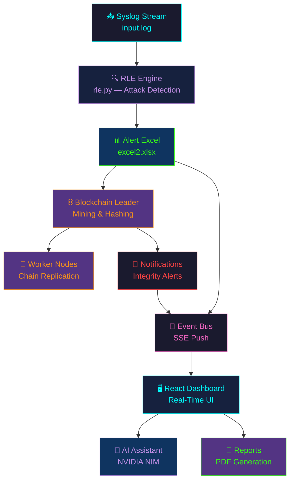

<div align="center">

<!-- LIVE DEMO & DOCS BADGES -->
[](https://cyberdefensex.dpdns.org/)
[](https://deepwiki.com/cyberhub2025/CyberDefenseX_Ultra)
[](LICENSE)
[](https://github.com/cyberhub2025/CyberDefenseX_Ultra/pulls)

<br/>
</div>
<div align="center">

## 💥 **Autonomous. Transparent. Unbreakable.**

> *A fully autonomous Cyber Defense System combining **real-time AI threat detection**, **blockchain-backed tamper-proof audit logs**, and **self-healing infrastructure** — delivering analyst-grade explainability and automated incident response.*

</div>

<br/>


---
<div align="center">
  
<!-- TECH STACK BADGES -->


</div>
## ✨ Core Capabilities

<div align="center">

| 🔮 Feature | ⚡ Description |
|:---|:---|
| 🔍 **Real-Time Log Analysis** | Continuously monitors syslog streams, parses HTTP access logs, and detects attacks in real time using the **RLE (Real-time Log Engine)** |
| 🤖 **AI-Powered Assistant** | NVIDIA NIM-backed conversational AI that analyzes live alert data, provides summaries, and recommends mitigations |
| ⛓️ **Blockchain Audit Trail** | Leader–Worker blockchain with SHA-256 hash chains, Merkle tree verification, and tamper detection for all alert records |
| 📊 **Interactive SOC Dashboard** | Rich React dashboard with threat charts, severity analytics, attack type visualization, and real-time notifications |
| 🗺️ **Global Threat Map** | Interactive geographic visualization of attack origins with IP geolocation mapping |
| 🔔 **SSE-Driven Updates** | Server-Sent Events push live alerts, notifications, and data changes instantly to all connected frontends |
| 📝 **Automated Reports** | One-click PDF report generation with ReportLab — severity breakdowns, timelines, and forensic details |
| 🔐 **Multi-Auth System** | Local credentials, Google OAuth, and GitHub OAuth with full session management |
| 🎨 **Theming & Customization** | Dark/Light/System themes, customizable accent colors, premium glassmorphic UI |

</div>

---

## 🏗️ System Architecture

<div align="center">

</div>

<br/>

### 🔄 How It Works

```
📥 Syslog Input ──► 🔍 RLE Engine ──► 📊 Alert Excel ──► ⛓️ Blockchain Leader
                                                                    │
                                                              🔄 Worker Nodes
                                                                    │
                          🖥️ React Dashboard ◄── 📡 Event Bus (SSE)
                                │
                    ┌───────────┴───────────┐
                  🤖 AI Assistant       📝 PDF Reports
```

1. **Log Ingestion** — Syslog data streams into `input.log` from network devices, servers, and endpoints
2. **RLE Stream Monitor** — Background thread parses log lines detecting SQL Injection, XSS, DoS, Brute Force, Directory Traversal, Session Hijacking, Cookie Stealing, and Credential Harvesting
3. **Alert Generation** — Detected threats written to `alerts.xlsx` with severity scoring (low → critical)
4. **Blockchain Immutability** — Leader node hashes alert data into `blockchain.json`; Worker nodes replicate & verify
5. **Integrity Monitoring** — Background checker polls `/blockchain/verify` to detect tampering
6. **Real-Time Frontend** — SSE event bus pushes `alerts.changed`, `logs.received`, and `notifications.new` events
7. **AI Analysis** — Users interact with AI Assistant via NVIDIA NIM API (GPT-oss-120B) for actionable insights

---

## 🛡️ Attack Detection Engine

> The **RLE (Real-time Log Engine)** detects attack types from raw HTTP access logs in real time.

<div align="center">

| 🚨 Attack Type | 🔬 Detection Method | 🎯 Severity |
|:---|:---|:---:|
| 💉 **SQL Injection** | `UNION SELECT`, `OR 1=1`, `sleep()`, `benchmark()`, `information_schema` | 🔴 Critical |
| 🕸️ **XSS** | Script tag injection, `document.cookie`, `window.location` hijacking | 🔴 Critical |
| 💣 **DoS** | ≥30 requests from same IP to same URL within 2-second sliding window | 🟠 High |
| 🔑 **Brute Force** | ≥5 failed login attempts (HTTP 401) from same IP within 10 seconds | 🟠 High |
| 📁 **Directory Traversal** | `../`, `%2e%2e%2f`, `/etc/passwd`, `php://filter` patterns | 🟡 Medium |
| 👤 **Session Hijacking** | `localStorage`/`sessionStorage` access via XSS payloads | 🔴 Critical |
| 🍪 **Cookie Stealing** | `document.cookie` exfiltration attempts | 🟠 High |
| 🎣 **Credential Harvesting** | Password field injection via XSS | 🔴 Critical |

</div>

---

## 🛠️ Tech Stack

<div align="center">

### 🖥️ Frontend
| Technology | Purpose |
|:---|:---|
| ⚛️ **React 18** | UI framework with HashRouter for GitHub Pages compatibility |
| 📊 **Recharts** | Interactive charts (Area, Pie, Bar, Line) |
| 🗺️ **React-Leaflet** | Threat map geographic visualization |
| 🌐 **React Globe.gl** | 3D globe threat visualization |
| 🎨 **Lucide React** | Icon system |
| 💅 **Tailwind CSS + Vanilla CSS** | Styling with dark/light theme support |

### ⚙️ Backend
| Technology | Purpose |
|:---|:---|
| 🐍 **FastAPI + Uvicorn** | Async REST API with hot-reload |
| 📡 **SSE-Starlette** | Server-Sent Events for real-time push |
| 🔐 **Authlib** | OAuth2 (Google, GitHub) authentication |
| 📊 **Pandas + OpenPyXL** | Log parsing, data analysis, Excel I/O |
| 🧠 **OpenAI SDK + NVIDIA NIM** | AI assistant (GPT-oss-120B via NIM API) |
| 📝 **ReportLab** | PDF report generation |
| 🗄️ **SQLite** | User database + app data (alerts, statuses, notifications) |

### ⛓️ Blockchain
| Technology | Purpose |
|:---|:---|
| 🔗 **Custom Python Blockchain** | SHA-256 hash chain with Merkle tree verification |
| 🔄 **Leader–Worker Architecture** | Leader mines blocks, Workers replicate & verify |
| 📡 **HTTP Broadcast** | Leader broadcasts new blocks to registered workers |
| ✅ **Tamper Detection** | Excel hash verification against blockchain state |

</div>

---

## 📂 Project Structure

```
🛡️ CyberDefenseX_Ultra/
│
├── 🔧 .github/
│   └── workflows/
│       └── deploy.yml              # GitHub Actions → GitHub Pages deployment
│
├── 🖥️ frontend/                    # React 18 SPA
│   ├── public/
│   │   ├── index.html              # Entry HTML with Tailwind CDN & Google Fonts
│   │   └── cyberdefenseX_canvas.png
│   └── src/
│       ├── App.js                  # Root component with HashRouter & theme management
│       ├── index.js                # React DOM entry point
│       ├── index.css               # Global design system & CSS variables
│       ├── components/
│       │   └── Sidebar.js/css      # Collapsible navigation sidebar
│       ├── hooks/
│       │   └── useEventStream.js   # SSE hook for real-time data push
│       └── pages/
│           ├── Landing.jsx/css     # Public landing page
│           ├── Login.js/css        # Auth page (local + OAuth)
│           ├── Overview.js/css     # Main SOC dashboard
│           ├── Threats.js/css      # Threat management
│           ├── Vulnerabilities.js/css  # Attack analytics
│           ├── ThreatMap.js/css    # Geographic visualization
│           ├── AIAssistant.js/css  # AI-powered security chatbot
│           ├── Blockchain.js/css   # Blockchain explorer
│           └── Settings.js/css     # User profile & customization
│
├── ⚙️ backend/                     # FastAPI application server
│   ├── app.py                      # Main API server
│   ├── ai.py                       # AI assistant logic
│   ├── rle.py                      # Real-time Log Engine
│   ├── event_bus.py                # Async pub/sub event system
│   ├── alerts_cache.py             # Thread-safe alert caching
│   ├── report.py                   # PDF report generation
│   ├── requirements.txt
│   └── Blockchain/
│       ├── leader/                 # ⛓️ Leader node (mining, hashing)
│       │   ├── blockchain.py
│       │   ├── broadcast.py
│       │   ├── blockchain.json     # The immutable ledger
│       │   └── alerts.xlsx         # Blockchain-protected alert spreadsheet
│       └── worker/                 # 🔄 Worker nodes (replication)
│           ├── blockchain.py
│           └── worker_blockchain.json
│
└── 📄 README.md
```

---

## 📊 Dashboard Pages

<div align="center">

| 🖥️ Page | 📋 Description |
|:---|:---|
| 🏠 **Overview** | Real-time stats, threat activity chart, severity distribution, attack analytics, network traffic, recent alerts & threat origins |
| ⚠️ **Threats** | Full threat table with severity/status filtering, sorting, and inline status management |
| 🔎 **Vulnerabilities** | Attack frequency bar chart, doughnut chart, attack timeline, Target IP vs Attack Type matrix |
| 🖥️ **Assets** | Asset inventory with status monitoring |
| 🗺️ **Threat Map** | Interactive Leaflet map showing geographic distribution of attack origins |
| 📝 **Reports** | Generate and download PDF security reports |
| 🤖 **AI Assistant** | Chat with the AI security analyst — NVIDIA NIM (GPT-oss-120B) with workbook-aware context |
| ⛓️ **Blockchain** | Blockchain explorer — chain integrity, block details, tamper-detection status |
| ⚙️ **Settings** | Profile management, security, notifications, theme customization, accent colors, API keys |

</div>

---

## ⚡ Quick Start

### 📋 Prerequisites
- **Node.js** ≥ 18 and **npm**
- **Python** ≥ 3.10 and **pip**

### `1` Clone the Repository
```bash
git clone https://github.com/cyberhub2025/CyberDefenseX_Ultra.git
cd CyberDefenseX_Ultra
```

### `2` Setup Backend
```bash
cd backend
pip install -r requirements.txt
python app.py
```
> 🟢 API server starts at `http://localhost:8000` with hot-reload enabled.

### `3` Setup Frontend
```bash
cd frontend
npm install
npm start
```
> 🟢 React app opens at `http://localhost:3000`.

### `4` Environment Variables

**Backend** (`backend/.env`):
```env
NVIDIA_API_KEY=your_nvidia_nim_api_key
FRONTEND_URL=http://localhost:3000
BACKEND_URL=http://localhost:8000
SECRET_KEY=your_secret_key
```

**Frontend** (`frontend/.env`):
```env
REACT_APP_BACKEND_API_URL=http://localhost:8000
```

---

## 🌐 Deployment

The frontend is automatically deployed to **GitHub Pages** on every push to `main` via **GitHub Actions**.

<div align="center">

[](https://cyberdefensex.dpdns.org/)

</div>

**To enable deployment on your fork:**
1. Go to **Settings → Pages** in your GitHub repository
2. Set **Source** to **GitHub Actions**
3. Push to `main` — the workflow handles the rest ✅

---

## 🗺️ Flow Diagram



---

## 🎯 Target Users

<div align="center">

| 👤 User | 🎯 Use Case |
|:---:|:---|
| 🛡️ **SOC Teams** | Automated triage and response workflows |
| 🏛️ **Government Cyber Defense Units** | Tamper-proof, court-admissible audit trails |
| ⚡ **Critical Infrastructure Operators** | Real-time threat monitoring and response |
| ☁️ **Managed Security Providers** | Multi-tenant alert management |
| 🎓 **Academic & Research Labs** | Cybersecurity research and demonstration |

</div>

---

## 📜 Roadmap

- [x] 🔍 Real-Time Log Engine (RLE) with multi-vector attack detection
- [x] ⛓️ Blockchain-backed immutable audit trail
- [x] 🤖 NVIDIA NIM AI Security Analyst
- [x] 📊 Interactive SOC Dashboard
- [x] 🗺️ Global Threat Map with IP Geolocation
- [ ] 🔐 Add zk-SNARK proofs to the blockchain layer
- [ ] 🧠 Reinforcement learning for adaptive threat response
- [ ] 📡 Expanded IoT/OT security agent support
- [ ] 🛰️ Multi-cloud federation for global SOC collaboration
- [ ] 📊 MITRE ATT&CK mapping for detected threats
- [ ] 🔄 Self-healing infrastructure with automated remediation playbooks

---

## 👨‍💻 Core Contributors

<div align="center">

<table>
  <tr>
    <td align="center" width="220px">
      <a href="https://github.com/shuvojitss">
        
        <br /><b>Shuvojit Samanta</b>
      </a>
      <br />
      
      <br/>
      
    </td>
    <td align="center" width="220px">
      <a href="https://github.com/gitadak">
        
        <br /><b>Soumyadeep Adak</b>
      </a>
      <br />
      
      <br/>
      
    </td>
    <td align="center" width="220px">
      <a href="https://github.com/Piyush-Sarkar">
        
        <br /><b>Piyush Sarkar</b>
      </a>
      <br />
      
      <br/>
      
    </td>
    <td align="center" width="220px">
      <a href="https://github.com/imon005">
        
        <br /><b>Imon Purkait</b>
      </a>
      <br />
      
      <br/>
      
    </td>
  </tr>
</table>

</div>

---

## 🤝 Contributing

Pull requests are welcome! For major changes, please open an issue first to discuss what you'd like to change.

📖 Read our full [**CONTRIBUTING.md**](CONTRIBUTING.md) for detailed guidelines on setup, coding standards, and PR procedures.

### 💛 Special Thanks
All community testers, researchers, and supporters for making **CyberDefenseX** better each day 🙏

---

## 📄 License

**MIT License** — free to use, modify, and distribute with attribution.

---

<div align="center">


<br/>

*Built with ❤️ by the CyberDefenseX Team — Securing the digital frontier, one block at a time.*

[](https://github.com/cyberhub2025/CyberDefenseX_Ultra)
[](https://github.com/cyberhub2025/CyberDefenseX_Ultra/fork)

</div>
